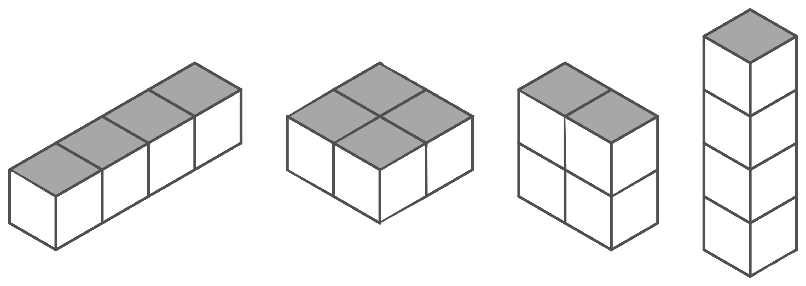
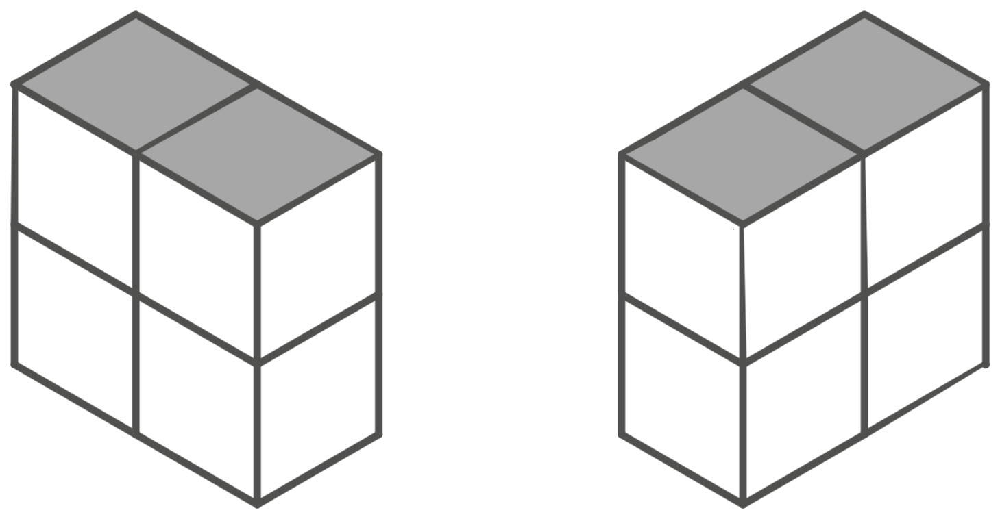

# Constructing Cuboids

I came across a Japanese highschool mathematics problem recently, which went
something along these lines:

How many different areas can you make by arranging six 1cm<sup>3</sup> blocks
into a cuboid?

For example, with four blocks, there are four different areas:



Note that although rotating a cuboid may yield a new area, rotating an area does
not count as a new area. The following areas are not considered different:



The question also supplied a table of the answer for different numbers of cubes:

| Number of Cubes | Number of different Areas |
| --------------- | ------------------------- |
| 1               | 1                         |
| 2               | 2                         |
| 3               | 2                         |
| 4               | 4                         |
| 5               | 2                         |
| 6               | ?                         |
| 7               | 2                         |
| 8               | 6                         |
| 9               | 4                         |


## Solution

The answer for six is five. Here they are:


How do we prove that there are no others? Each area will be `a x b`, where both
`a` and `b` are factors of 6 (since we are only arranging the blocks). In
addition, 6 must also be divisible by `a x b`, and that will become the height.

We do not distinguish between `a x b` and `b x a`, so from here we will assume
`a` ≥ `b`.

The factors of six are: 1, 2, 3, and 6. For each pair of factors (with
replacement) whose product is also a factor, we can construct a different area:

- 1 x 1
- 2 x 1
- 3 x 1
- 3 x 2
- 6 x 1

Since there are no more pairs of factors that satisfy these requirements, these
are the only areas, and so there are only five.

After making this insight, we can be sure that this sequence is [A140773]() in
the OEIS.

## What about a general solution?

What if we want to know the number of solutions for n cubes? Here is a naiive
algorithm for counting all solutions in python:

```python
# Assume we have access to factors(n) which iterates the factors of n in
# ascending order.

def countAreas(n):
    # Keep a running count of the number of areas.
    result = 0

    # `a` will be the long side of the area.
    for a in factors(n):
        # `b` will be the short side of the area.
        for b in factors(n // a):
            if b > a:
                break
            result += 1

    return result
```

Inspecting this algorithm can help us notice some special cases:

- If n is prime, the answer will be 2.
  - 1 x 1
  - n x 1
- If n is a square of a prime, p, the answer will be 4.
  - 1 x 1
  - p x 1
  - p x p
  - n x 1
- If n is a cube of a prime, p, the answer will be 6.
  - 1 x 1
  - p x 1
  - p x p
  - p<sup>2</sup> x 1
  - p<sup>2</sup> x p
  - p<sup>3</sup> x 1
- If n is p<sup>4</sup> for some prime p, the answer will be 9.
  - 1 x 1
  - p x 1
  - p x p
  - p<sup>2</sup> x 1
  - p<sup>2</sup> x p
  - p<sup>2</sup> x p<sup>2</sup>
  - p<sup>3</sup> x 1
  - p<sup>3</sup> x p
  - p<sup>4</sup> x 1

If n = p<sup>k</sup> for some prime p and some positive integer k, the number of
different areas will be

%5E2%7D%7B4%7D)

If k is even and

(k%2B3)%7D%7B4%7D)

If k is odd.

*We can prove this by induction on k.*

If we have a product of two prime powers, n =
p<sub>1</sub><sup>k<sub>1</sub></sup>p<sub>2</sub><sup>k<sub>2</sub></sup>, then
we can see the different areas possible in the form of a grid.

On one axis we write the different possible areas for
p<sub>1</sub><sup>k<sub>1</sub></sup> and on the other axis, we write the different
possible areas for p<sub>2</sub><sup>k<sub>2</sub></sup>. We will illustrate how
to fill the grid with an example:

lets choose 72 = 2<sup>3</sup>3<sup>2</sup>.

|                       | 1 x 1             | 3 x 1                                      | 3 x 3                 | 3<sup>2</sup> x 1                                                  |
| --------------------- | ----------------- | ------------------------------------------ | --------------------- | ------------------------------------------------------------------ |
| **1 x 1**             | 1 x 1             | 3 x 1                                      | 3 x 3                 | 3 x 2                                                              |
| **2 x 1**             | 2 x 1             | (2·3 x 1, 3 x 2)                           | 2·3 x 3               | (2·3<sup>2</sup> x 1, 3<sup>2</sup> x 2)                           |
| **2 x 2**             | 2 x 2             | 2·3 x 2                                    | 2·3 x 2·3             | 2·3<sup>2</sup> x 2·3                                              |
| **2<sup>2</sup> x 1** | 2<sup>2</sup> x 1 | (2<sup>2</sup>·3 x 1, 2<sup>2</sup> x 3)   | 2·3<sup>2</sup> x 3   | (2<sup>2</sup>·3<sup>2</sup> x 1, 3<sup>2</sup> x 2<sup>2</sup>)   |
| **2<sup>2</sup> x 2** | 2<sup>2</sup> x 2 | (2<sup>2</sup>·3 x 2, 2<sup>2</sup> x 2·3) | 2·3<sup>2</sup> x 2·3 | (2<sup>2</sup>·3<sup>2</sup> x 2, 2·3<sup>2</sup> x 2<sup>2</sup>) |
| **2<sup>3</sup> x 1** | 2<sup>3</sup> x 1 | (2<sup>3</sup>·3 x 1, 2<sup>3</sup> x 3)   | 2·3<sup>3</sup> x 3   | (2<sup>3</sup>·3<sup>2</sup> x 1, 3<sup>2</sup> x 2<sup>3</sup>)   |

Only in the case that both the area on the x axis (from
p<sub>1</sub><sup>k<sub>1</sub></sup>) and the y axis (from
p<sub>2</sub><sup>k<sub>2</sub></sup>) are asymmetrical (the area is not square)
do we have two ways to combine the original areas. Otherwise there is only one
distinct way to combine the areas.

This is great news! If we can generate a formula for the number of square areas,
we could define a multiplicative solution based on the prime factorisation of
any given number.

How many square areas can a prime power, p<sup>k</sup>, have? If k is even, then
we will have k / 2, because we will have 1 x 1, p x p, ..., p<sup>k/2</sup> x
p<sup>k/2</sup>. If k is odd, then we will have a similar situation but with (k
\- 1) / 2.
We can now define a much faster algorithm based on this multiplicative property:

*The main algorithm is at the bottom, but it makes use of the helper methods
above it.*

```python
def totalAndSquare(k):
    """
    Calculates the total number of different areas and the number of those areas
    that are square for a number n if n = p^k for some prime p and positive
    integer k.
    """
    m = k >> 1
    return (
      m ** 2 + (2 + (k & 1)) * m + (1 + (k & 1)),
      m + 1
    )

def primePowerCounts(n):
    """
    When given a number n with prime factorisation p1^k1·p2^k2·...·pm^km,
    iterates over the numbers k1, k2, ..., km.
    """
    p = 2
    # We could be more efficient here if we iterated over primes instead of all
    # the numbers, but if we were going to implement finding those primes it
    # would cause us to fall back to the same time complexity.
    while p * p <= n:
        count = 0
        while n % p == 0:
            n //= p
            count += 1
        if count > 0:
            yield count
        p += 1
    if n > 1:
        # The remainder of n must be a prime.
        yield 1
  
def reducer(acc, value):
    """
    Applies the multiplicative property to accumulate the results from all of
    the prime powers into a single result.
    """
    prevTotal, prevSquare = acc
    total, square = value

    return (
      prevTotal * total + (prevTotal - prevSquare) * (total - square),
      prevSquare * square
    )

def countAreas(n):
    """
    Counts the number of different areas obtained when arranging n cubes into a
    cuboid.
    """
    return reduce(
        reducer,
        map(
          totalAndSquare,
          primePowerCounts(n)
        )
    )[0]
```

# Formal Proofs

We have explained our intuition behind the problem; let's now make some
statements and prove them. The sequence in the OEIS currently has the terms
1..10000. If we can prove our findings, lets add some more terms! 

Instead of writing the definition out every time, let the number of distinct
areas obtained by arranging n unit cubes into a cuboid be A(n). Also, let the
number of square areas obtained be S(n).

### Proposition [1]

For a prime power, n = p<sup>k</sup>, (p prime, k a positive integer) we have:

%20%3D%20%5Cbegin%7Bcases%7D%0A%20%20%20%20%5Cfrac%7B(k%2B2)%5E2%7D%7B4%7D%20%26%20%5Ctext%7BIf%20k%20is%20even%7D%20%5C%5C%0A%20%20%20%20%5Cfrac%7B(k%2B1)(k%2B3)%7D%7B4%7D%20%26%20%5Ctext%7BIf%20k%20is%20odd%7D%0A%5Cend%7Bcases%7D)

***proof:***

Let n = p^k for some prime p and some positive integer k. Fix integers a, b such
that 0 ≤ a ≤ b ≤ k and a + b ≤ k. Consider the area

> p<sup>a</sup> x p<sup>b</sup>

This is a valid area of a cuboid consisting of p<sup>k</sup> cubes, it has side
lengths p<sup>a</sup>, p<sup>b</sup> and p<sup>k - (a + b)</sup>. So A(n) must
be greater than or equal to the number of such a and b. (1)

Considering the factors of p<sup>k</sup> (1, p, p<sup>2</sup>, ...,
p<sup>k</sup>) any valid area must be of the form

> p<sup>a</sup> x p<sup>b</sup>

for some integers 0 ≤ a ≤ k and 0 ≤ b ≤ k. Since we do not distinguish between
p<sup>a</sup> x p<sup>b</sup> and p<sup>b</sup> x p<sup>a</sup>, let a ≤ b.
Also, since the remaining side length must be p<sup>k - (a + b)</sup>, we have a
\+ b ≤ k. Therefore A(n) must also be less than or equal to the number of such
pairs a, b. (2)

Due to (1) and (2), we see that A(n) must be equal to the number of integers a,
b such that 0 ≤ a ≤ b ≤ k and a + b ≤ k.

To count these, fix 0 ≤ b ≤ k. We want to count the number of a ≥ 0 such that a
≤ b and a + b ≤ k (a ≤ k - b). 

Suppose b < k / 2, then b < k - b. The number of 0 ≤ a ≤ b is b + 1.

Suppose instead that b > k / 2, then k - b < b. The number of 0 ≤ a ≤ k - b is k
\- b + 1. Note that both b such that b < k / 2 and k - b such that b > k / 2 run
over the same values.

Suppose b = k / 2, then b = k - b. The number of 0 ≤ a ≤ k / 2 is k / 2 + 1.

If k is odd, let k = 2m + 1, and this will be our result:

%20%26%3D%202(%5Csum_%7Bb%20%3D%200%7D%5E%7Bm%7Db%20%2B%201)%20%5C%5C%0A%26%3D%202(%5Csum_%7Bi%20%3D%201%7D%5E%7Bm%20%2B%201%7Di)%20%5C%5C%0A%26%3D%202%5Cfrac%7B(m%20%2B%201)(m%20%2B%202)%7D%7B2%7D%20%5C%5C%0A%26%3D%20(%5Cfrac%7Bk%20-%201%7D%7B2%7D%20%2B%201)(%5Cfrac%7Bk%20-%201%7D%7B2%7D%20%2B%202)%20%5C%5C%0A%26%3D%20%5Cfrac%7B(k%20-%201%20%2B%202)(k%20-%201%20%2B%204)%7D%7B4%7D%20%5C%5C%0A%26%3D%20%5Cfrac%7B(k%20%2B%201)(k%20%2B%203)%7D%7B4%7D%0A%5Cend%7Bsplit%7D)

If k is even, let k = 2m:

%20%26%3D%202(%5Csum_%7Bb%20%3D%200%7D%5E%7Bm-1%7Db%20%2B%201)%20%2B%20m%20%2B%201%20%5C%5C%0A%26%3D%202(%5Csum_%7Bi%20%3D%201%7D%5E%7Bm%7Di)%20%2B%20m%20%2B%201%20%5C%5C%0A%26%3D%202%5Cfrac%7Bm(m%20%2B%201)%7D%7B2%7D%20%2B%20m%20%2B%201%20%5C%5C%0A%26%3D%20(m%20%2B%201)%5E2%20%5C%5C%0A%26%3D%20(%5Cfrac%7Bk%7D%7B2%7D%20%2B%201)%5E2%20%5C%5C%0A%26%3D%20%5Cfrac%7B(k%20%2B%202)%5E2%7D%7B4%7D%0A%5Cend%7Bsplit%7D)

QED.

### Proposition [2]

For a prime power, n = p<sup>k</sup>, (p prime, k a positive integer) the number
of square areas, S(n), is given by:

